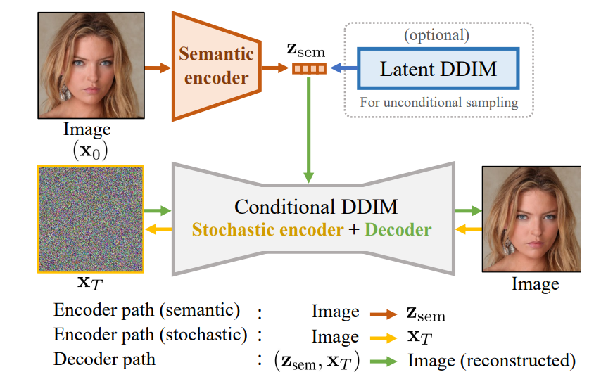
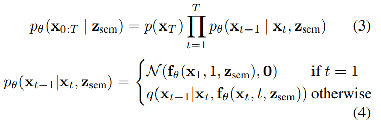
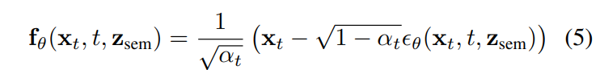
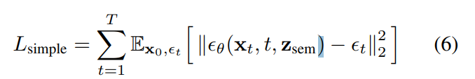
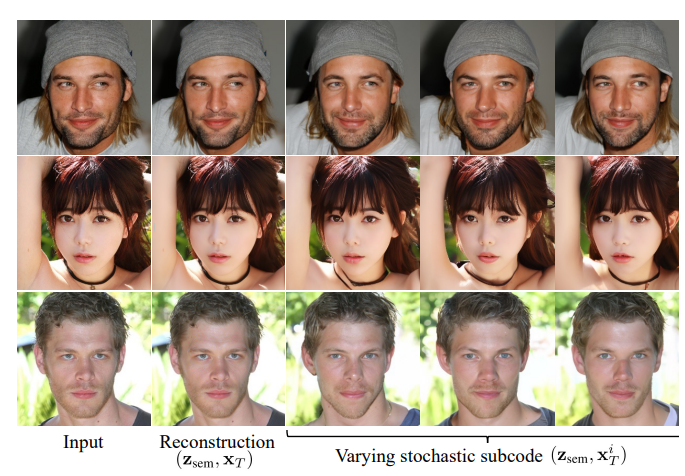
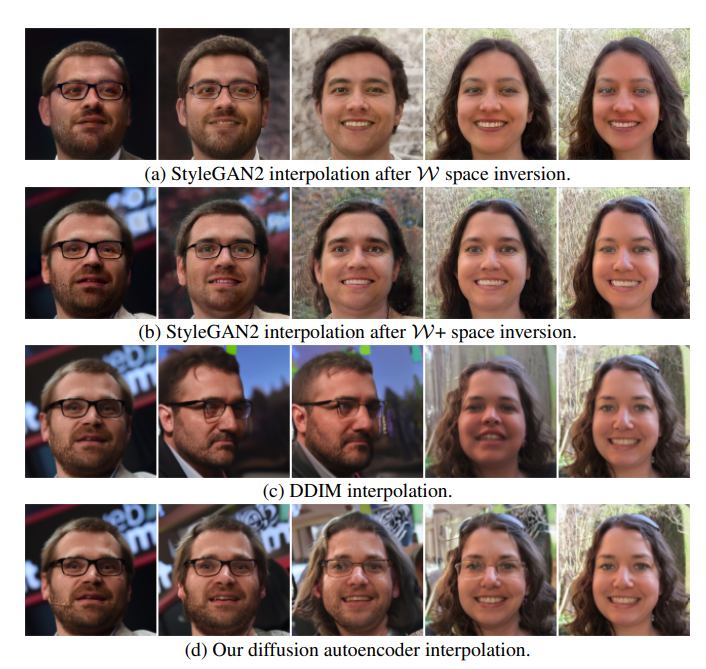
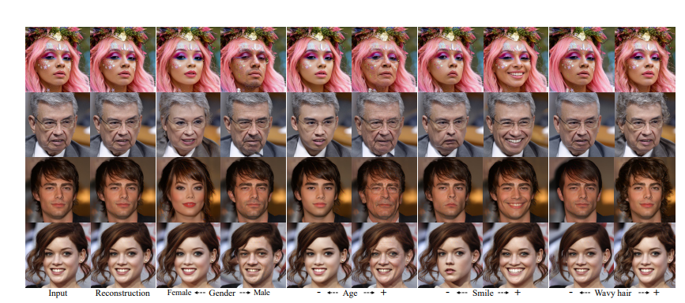

# Diffusion Autoencoders：Toward a Meaningful and Decodable Representation
## 摘要
DPMs(扩散概率模型)在图像生成方面取得显著效果，与GAN相比扩散模型使用不能在其他任务中使用的表示——一组缺乏语义的潜在变量。该论文探讨了使用扩散模型进行[[表征学习]]的可能性并使用自动编码来提取有意义可解码的输入图像表示。
==key idea：==使用一个可学习的编码器来发现高级语义，DPM作为解码器来模拟剩余的随机变化。

将任何图像编码作为两部分，一部分为有语义和线性的一部分时捕捉的细节。这种两级编码提高了去噪效率并促进各种下游任务包括少量条件采样。
## Introduction
基于扩散和基于分数的生成模型在生成高精度图像上可以和GAN媲美，这两个模型密切相关，在实践中也密切相关。应用于图像操作、翻译、超分辨率，语言和文本,以及三维点云领域。
### 算法设计
捕捉高层语义和低层随机变化的==关键思想就是利用可学习的编码器发现高层语义，利用DPM来解码和对随机变化建模==使用**去噪隐含模型(DDIM)** 的**变体**作为解码器，并将潜伏代码分成两个子代码。
==第一个 "语义 "子码是紧凑的，用CNN编码器来推断，而第二个 "随机 "子码是通过反转我们的DDIM变体的生成过程并以语义子码为条件来推断的。==DDIM的前向过程为非[[Marcov Chain]]，与DPM不同，保留了DPM的训练目标。这个修改允许将图像确定地编码为其相应的初始噪声，这代表我们的随机子码。
### 模型优势
DDIM相比DPM去噪变化更加简单迅速，同时这样的设计产生的表征线性、有语义可解码。
相比GAN，
- 这种方法不需要对输入编码优化就可以生成保留原始细节的高质量输出。
相比其他DPM，
- 无需与先前工作额外对比性学习
## 背景
一个成功的处理过程可以去噪或者将任意高斯噪声图在T次成功的去噪过程中变成一个干净的图像样本。
[diffusion基本介绍](https://lilianweng.github.io/posts/2021-07-11-diffusion-models/#conditioned-generation)
作为潜变量模型，DPMs可以通过正向过程自然的产生潜变量，但是这个变化是随机的，只包括高斯噪声的图像退化序列不包含语义信息。
同时由于需要设置较长的扩散步数才能获得好的效果，导致生成样布的速度较慢。
仔细分析[DDIM](https://zhuanlan.zhihu.com/p/565698027)的优化目标会发现，DDPM其实仅仅依赖边缘分布$q(X_t|X_0)$,而不是直接作用在联合分布$q(X_{1:T}|X_0)$,由此我们可以想到DDPM的隐变量模型可以有很多推理选择而不是只能选择马可夫过程，只要满足边缘分布条件，所以我们可以重新定义分布$q(X_{t-1}|X_t,X_0)$,DDIM中的重新定义为：
$$
q_\sigma(X_{t-1}|X_t,X_0)=\mathcal{N}(X_{t-1};\sqrt{\alpha_{t-1}}X_0+\sqrt{1-\alpha_{t-1}-\sigma_t^2}\frac{X_t-\sqrt{\alpha_t}X_0}{\sqrt{1-\alpha_t}},\sigma_t^2I)
$$
这个过程可以产生一个非常精确的重建，然而，xT仍然不包含高级的 语义，这促使人们采用的新的方法解决这个问题，正如本篇文章所提到的。
## 扩散自编码器

在寻求一v额有意义的潜在码时，我们设计了一个条件DDIM图像解码器以附加的潜在变量$z_{sem}$，$p(X_{t-1}|X_t,Z_{sem})$以及一个语义编码器$z_{sem}=Enc(X_0)$,该编码器学习将输入的图片$X_0$映射到有语义$z_{sem}$。

DDIM解码器将一个潜在变量$z=(z_{sem},x_T)$作为输入,z同时包含了高层的语义子码和低层的随机子码，通过逆向生成过程进行解码。因此DDIM既是编码器又是解码器。通过对照如上图片可以很容易的理解此过程。

$Z_{sem}$是一个非空间的512维度的向量，允许我们的编码对全局语义进行编码不针对任何空间领域。
### 基于扩散的解码器
**这部分DDIM的扩展看的有点半懂不懂**
如之前提到的，我们将$X_0$换成包含语义的$Z_{sem}$,最后公式如下：

使用自适应的UNet 群归一化层（AdaGN），通过对归一化的特征图h∈R进行通道的缩放和移动来扩展组归一化。

### 语义编码器
语义编码器的目的是将输入图像总结为一个包含关键信息的描述性向量$Z_{sem}$从而帮助解码器去噪和预测输出图像。用富含信息的$Z_{sem}$调节DDIM的一个好处是更有效的去噪过程。
## 扩散自动编码器的采样
我们需要一个算法来为$Z_{sem}$在隐含分布中采样，GAN和VAE都有其缺陷。我们在这里使用另一个DDIM,**latent DDIM**来为$Z_{sem}$进行采样。
latent DDIM $p_\omega(z_{sem},t-1|z_{sem},t)$
$z_{sem}=Enc_\phi(x_0)$
通过$L_{latent}$进行模型优化
$L_{latent}=\sum^{T}_{1}\mathbb{E}_{z_{sem},\epsilon_t}[||\epsilon_\omega(Z_{sem,t},t)-\epsilon_t||]$

其中：
$\epsilon_t\in\mathbb{R}^d\sim\mathcal{N}(0,I)$
$z_{sem}=\sqrt{\alpha_t}z_{sem}+\sqrt{1-\alpha_t}\epsilon_t$

## 实验结果
我们采用对比实验，一个就是基于Dhariwal等人的改进架构对DDIM的重新实现，一个就是本篇文章采用$z_{sem}$的改进的架构。所采用的超参相同。
### 潜在编码同时捕捉到高层次的语义和低层次的随机变化
为了证明高层次的语义是在$Z_{sem}$中捕获的，我们继续进行对照实验，下图1中我们对在同$Z_{sem}$中进行图像的生成，我们发现随机子码的不同只能对一个人的外观进行轻微的扰动，而下图2中，我们通过改变$Z_{sem}$将图像转化为完全不同的人的形象。

### 有语义的潜在插值
理想的潜在空间就是能通过简单的线性变化就能表示图像的语义变化，和DDIM相比，DDIM模型生成的图像变化非平滑，我们的方法生成的图像在两个端点图像中平滑的改变面部表情、背景和头型，在StyleGan中生成的图像是平滑的，但是两个端点和输入图像不同，而我们的模型生成的图片基本和输入图片一致。

### 对真实图像进行属性操作
评估图像语义与潜伏空间中的线性运动或可分离性之间关系的另一种方法是将$Z_{sem}$朝指定方向移动，观察图像的变化。
论文中使用CelebA-HQ的图像和属性标签训练了线性分类器，并在下图中进行测试。

通过改变局部特征，同时保持图像其他部分和细节基本不变，对于同时改变多个特征的全局属性，结果看起来更加合理和现实。同时将本模型和StyleGAN-W对比AUROC值，我们方法为0.925，StyleGAN-W为0.891。

[AUROC](http://wkunblog.com/2021/10/20/%E4%BA%8C%E5%88%86%E7%B1%BB%E8%AF%84%E4%BB%B7%E6%8C%87%E6%A0%87AUROC-AUPRC/)

[FID](https://zhuanlan.zhihu.com/p/474833906)

**原论文：[Diffusion Autoencoders：Toward a Meaningful and Decodable Representation](https://arxiv.org/abs/2111.15640)**

