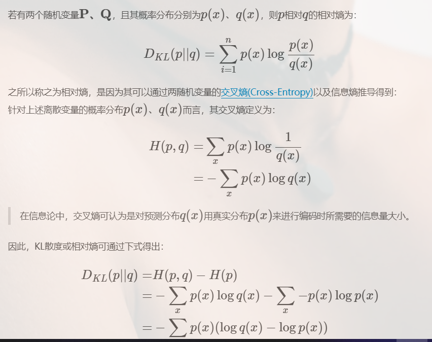

## 熵和交叉熵

提到交叉熵就需要了解下信息论中熵的定义。信息论认为：

> **确定的事件没有信息，随机事件包含最多的信息。**

事件信息的定义为：$I(x)=−\log(P(x))$；而熵就是描述信息量：$H(x)=E_{x∼P}[I(x)]$，也就是$H(x)=E_{x∼P}[−log(P(x))]=−\sum_xP(x)\log(P(x))$，公式中的E表示x关于p(x)的期望。如果log的base是2，熵可以认为是衡量编码对应的信息需要的最少bits数；那么交叉熵就是来衡量用特定的编码方案Q来对分布为P的信息x进行编码时需要的最少的bits数。定义如下：  $H(P,Q)=−\sum_xP(x)log(Q(x))$
## KL散度的定义
KL散度的定义是建立在熵(Entropy)的基础上的。此处以离散随机变量为例，先给出熵的定义，再给定KL散度定义。
若一个离散随机变量$X$的可能取值为$X={x_1,x_2,...x_n}$,而对应的概率$p_i=p(X=x_i)$,则随机变量X的熵定义为：
$H(X)=-\sum^{n}_{i=1}p(x_i)logp(x_i)$

所以最小化交叉熵与最小化KL散度等价

## 统计学意义上的KL散度:

在统计学意义上来说，KL散度可以用来衡量两个分布之间的差异程度。若两者差异越小，KL散度越小，反之亦反。当两分布一致时，其KL散度为0。正是因为其可以衡量两个分布之间的差异，所以在VAE、EM、GAN中均有使用到KL散度。

因为KL散度不具有交换性，因此不能简单的理解为距离的概念，衡量的因素不是两个分布空间上的远近，而应该理解为衡量一个分布相比另一个分布的信息损失。