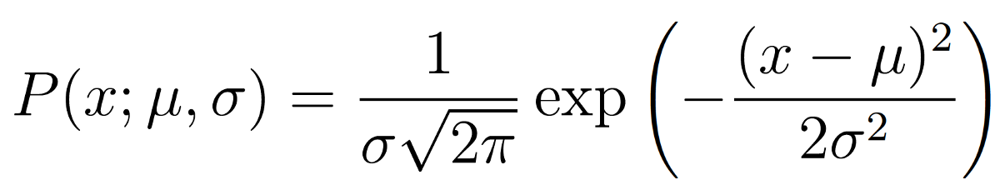

[TOC]

# Lilian 学习笔记

[Lilian Weng What are Diffusion Models?](https://lilianweng.github.io/posts/2021-07-11-diffusion-models)学习笔记
本篇文章是对Lilian大佬关于Diffusion模型的介绍的翻译加笔记，限于本人水平太菜，由很多地方可能理解不够到位，一切理解以Lilian大佬的原文为主。

GAN模型有潜在的不稳定序列和较少的生成多样性，VAE依赖于代用损失，流模必须使用专门架构构建可逆变换。
扩散模型是受非平衡热力学的启发。它们定义了一个扩散步骤的马尔可夫链，以缓慢地将随机噪声添加到数据中，然后学习逆转扩散过程，从噪声中构建所需的数据样本。与VAE或流动模型不同，扩散模型是用固定的程序学习的，而且潜变量具有高维度（与原始数据相同)。

## 前向扩散过程
给定真实图片 $x_0 \sim q(x)$,diffusion前向过程通过 $T$次累计对其添加高斯噪声，得到$x_1, x_2, \ldots, x_T$ ，如下图的q过程。这里需要给定一系列的高斯分布方差的超参数 $\left\{\beta_t \in(0,1)\right\}_{t=1}^T$ .前向过程由于每个时刻 $t$ 只与 $t-1$ 时刻有关，所以也可以看做马尔科夫过程：
### 高斯公式

该高斯公式表示x为变量其他两个为参数的高斯曲线。
在此基础上就很好理解，前向过程的推导公式。
#### 前向过程推导公式
$q\left(x_t \mid x_{t-1}\right)=\mathcal{N}\left(x_t ; \sqrt{1-\beta_t} x_{t-1}, \beta_t \mathbf{I}\right), q\left(x_{1: T} \mid x_0\right)=\prod_{t=1}^T q\left(x_t \mid x_{t-1}\right)$

随着t增大，$x_t$噪声随之增大，当$T \rightarrow \infty, \quad x_T$是完全的高斯噪声（下面会证明，$\sqrt{1-\beta_t}$且与均值系数的选择有关）。$\beta_t$是随着t增大而递增的，$\alpha_t=1-\beta_t$即$\alpha_t$实际上是在不断减小。!$\beta_1<\beta_2<\ldots<\beta_T\text { 在GLIDE的code中， } \beta_t \text { 是由 } 0.0001 \text { 到0.02线性插入值 }$

### diffusion推导过程中的重要特性
#### 特性1：重参数（reparameterization trick）
重参数技巧在很多工作（gumbel softmax, VAE）中有所引用。如果我们从某个分布中随机采样（高斯分布）一个样本，这个过程无法反传梯度。而通过高斯噪声采样得到的$x_t$的过程在diffusion中导出都是，因此我们我们需要通过重参数使其可微。最通常的做法是把随机变量$\epsilon$引导过去。
如果从高斯分布采样一个z,我们也可以写成

此时z依旧具有随机性，且满足$\mu_\theta,\sigma_\theta^2$可以是由参数$\theta$的神经网络推断得到的。采样过程依旧梯度可到，随机性被转嫁到$\epsilon$上。

由特性1我们对特性2公式进行推导
-------------------------->>>>>>>>>>>
#### 特性2：任意时刻的$x_t$可以由$x_0$和$\beta$表示
能够通过$x_0$和$\beta$快速得到$x_t$对后续diffusion模型的推断和推导由巨大作用。首先我们假设$\alpha_t=1-\beta_t$并且$\bar{\alpha_t}=\prod^{T}_{i=1}\alpha_i$,展开$x_t$可以得到。

==tips:上述公式就是一个简单的迭代推导过程。==
注解：由于高斯分布可加性，即$\mathcal{N}(0,\sigma^2_1I)+\mathcal{N}(0,\sigma^2_2I)=\mathcal{N}(0,(\sigma^2_1I+\sigma^2_2I))$
我们可以得到

由此我们可以化简上述公式的第二部分。

因此我们可以得出，公式三中的$\sqrt{\bar{\alpha_t}x_0}$为高斯公式的均值，$\sqrt{1-\bar{\alpha_t}\bar{z_t}}$
为高斯公式的方差$\sigma$。
所以任意时刻下，$x_t$满足$q(x_t|x_0)=\mathcal{N}(x_t;\sqrt{\bar{\alpha_t}x_0},(1-\bar{\alpha_t})I)$
### 前向扩散过程总结
$\beta$作为超参数，随着t增大而增大，$1-\beta$也随之减小。$\beta$参数同时参与了T时刻下，$x_t$的均值和方差，保证了在$T\rightarrow\infty$时，噪声收敛到方差为一的高斯分布。
### 与随机梯度朗之万动力学的关系
朗之万动力学是一个来自物理学的概念，为统计学上的分子系统建模而开发。与随机梯度下降相结合，随机梯度朗之万动力学可以在一个马可夫链更新中仅使用梯度$\nabla_x\log(p(x))$ ，从一个随机可能性密度函数$p(x)$中生成样本。

==公式中$\delta$表示步长，当$T\rightarrow\infty$时，$\epsilon\rightarrow0$,$X_T$等价于实际的可能密度$p(x)$.==
**和标准的梯度下降相比，朗之万随机梯度在参数更新中加入了高斯噪声从而避免陷入局部最小值**
## 逆向推断过程
如果说前向过程就是加噪声的过程，逆向过程就是diffusion模型去噪声的过程。假设我们能将上述的正向过程倒过来我们就可以获得逆转后的分布$q(x_{t-1}|x_t)$，从高斯噪声$x_T\sim\mathcal{N}(0,I)$输入中重新创造真实样本。
如果$q(x_t|x_{t-1})$满足高斯分布且参数$\beta_t$足够的小，那么$q(x_{t-1}|x_t)$仍然是一个高斯分布。不幸的是，我们无法简单的推断$q(x_{t-1}|x_t)$，因为它需要使用整个数据集，因此我们需要通过学习一个模型$p_\theta$(现在一般使用U-net模型)来对条件概率继续近似以便于进行反向扩散过程。

即$p(x)$为预测模型，$q(x)$为实际数据，我们在设置完$p(x)$后，通过KL散度来进行模型效果的评估。

### 多元条件概率补充
==tips:首先补充一下多元条件概率的知识，这对理解接下来的公式很重要。==

接下来我们开始推导逆向公式。

### 公式推导
#### 逆向公式

我们无法直接得到$q(x_{t-1}|x_t)$，但是我们可以通过映入$x_0$来比较容易的预测$x_{t-1}$,引入$x_0$之后，公式变为，变形过程参照[[Lilian blog 学习笔记#多元条件概率补充]]，引入$x_0$后的变化巧妙的把逆向过程转化为正向过程，

带入高斯公式进行变化（具体变化步骤没看懂）
------------>
------------->经过整理之后我们可以得出

由[[Lilian blog 学习笔记#高斯公式]]的表现形式，我们可以得出

根据[[Lilian blog 学习笔记#特性2：任意时刻的x_t可以由x_0和beta表示]]我们将该特性进行变形，可以得到

进一步化简均值公式有：

其中$\bar{\epsilon}$为高斯分布，为深度模型预测的噪声。

### 优化交叉熵
我们通过最大化模型预测分布的对数似然，即优化$q(x_0)和p(x_0)$的交叉熵的方式来优化对数似然，
$L=-\mathbb{E}_{q(x_0)}[q(x_0)\log(p_\theta(x_0))]$
#### VLB优化
由于该过程很想VAE所以我们采用变分下限(VLB)来优化对数似然函数。由于KL散度非负，所以我们有如下公式：

接下来我们采用VLB进行优化，在不等式的两侧同时乘上$\mathbb{E}_{q(x_0)}$

由此公式我们可以得出结论，使得$L_{VLB}$最小，即可使$L$最小，即目标损失最小。
#### Jensen's不等式优化

#### LVLB进一步推导
为了将方程中每个项转化为可分析的计算，可以将$L_{VLB}$进一步改写为KL散度和熵的累加。
以知：$$L_{VLB}=\mathbb{E}_{q(x_0:T)}[\log(\frac{q(X_{1:T}|X_0)}{p_\theta(X_{0:T})})]$$
运用[[Lilian blog 学习笔记#前向过程推导公式]][[Lilian blog 学习笔记#逆向公式]]
我们可以得到如下推导，如下推导也是一个迭代过程：

在$L_{VLB}$中$X_T$是纯高斯噪声，因为$q$没有可学习的参数所以$L_T$可以视为常量忽略，$L_0$使用单独的离散解码器$\mathcal{N}(x_0;\mu_\theta(x_1,1),\sum_\theta(x_1,1))$
而每一个$L_t$比较两个高斯分布，因此他们可以被闭合形式计算。
### 训练损失$L_t$的参数化
由于$L_{VLB}$基本上由$L_t$来决定，因此神经网络的预测效果基本是通过最小化$L_t$来实现的。
$L_t$是两个高斯分布$q(x_{t-1}|x_t,x_0)=\mathcal{N}(x_{t-1};\tilde{\mu}(x_t,x_0),\tilde{\beta_t}I)$和$p_\theta(x_{t-1}|x_t)=\mathcal{N}(x_{t-1};\mu_\theta(x_t,t),\sum_\theta)$的KL散度。根据多元高斯分布的KL散度求解可得：

我们需要通过学习一个神经网络来近似反向扩散过程中的条件概率分布，$p_\theta(x_{t-1}|x_t)=\mathcal{N}(x_{t-1};\mu_\theta(x_t,t),\sum_\theta(x_t,t))$。我们希望通过训练$\mu_\theta$来预测$\tilde{\mu_t}=\frac{1}{\sqrt{\alpha_t}}(x_t-\frac{1-\alpha_t}{\sqrt{1-\bar{\alpha_t}}}\epsilon_t)$因为$x_t$可以在训练过程中作为输入，我们可以[[Lilian blog 学习笔记#特性1：重参数（reparameterization trick）|重参数化]]高斯噪声项，使其在步骤t中从输入$x_t$中预测$\epsilon_t$,而损失项$L_t$被参数化用来最小化$\tilde{\mu}$的差异。

#### 公式简化
根据2020年Ho et al的研究(DDPM)发现，使用忽略加权项的简化参数来训练diffusion模型的效果更好，简化后的参数如下：

最终的简化目标为：
$L_{simple}=L_t^{simple}+C$
其中，C为不依赖于$\theta$的常量
由简化后的公式可以看出，diffusion训练的损失函数核心在于取$\bar{\epsilon_t},\epsilon_\theta$的均方误差。

### $\beta_t$的参数化
在[DDPM](../../论文阅读/DDPM.pdf)中前向过程中的变化参数被设置为一系列线性增加的常数，从$\beta_1={10}^{-4}$到$\beta_T=0.02$。与归一化的图像像素值相比他们相对较小，
扩散模型在他们的实验中显示了高质量的样本，但仍然不能像其他生成模型那样取得有竞争力的模型对数似然。
Nichol&Dhariwal（2021）提出了几种改进技术，以帮助扩散模型获得更低的NLL损失。其中一项改进是使用基于余弦的方差调度。排列函数的选择可以是任意的，只要它能在训练过程中间提供一个近乎线性的下降，并在$t=0$和$t=T$周围提供微妙的变化。

s值取尽可能的小从而避免到t接近0时，$\beta_t$太小。

## 加速模型采样
按照DDPM中算法根据==马可夫链进行反向扩散生成样本速度非常慢==，T可能增加到几千步，同比GAN来说相差甚远。
- 一个简单的加快速度的方法就是进行跨步采样，每隔T/S步进行抽样，将T步减少到S步。

- 另一个方法是我们根据[[Lilian blog 学习笔记#特性2：任意时刻的$x_t$可以由$x_0$和$ beta$表示|特性2]]可以重新改写$q_\sigma(x_{t-1}|x_t,x_0)$的参数化使其可以成为一个标准方差。

我们将方差设置为$\sigma_t^2=\eta\cdot\tilde{\beta_t}$,我们可以将$\eta$作为控制抽样随机性的超参,当$\eta=0$时，采样过程确定，在[DDIM](https://arxiv.org/abs/2010.02502)中就采用了这样的设计。使DDIM具有相同的边际噪声分布，但确定地将噪声映射回原始数据样本。
假设总采样T=1000,间隔S,当S很小的时候，$DDIM(\eta=0)$取得很好的结果，使用DDIM，可以训练扩散模型到任意数量的前向步骤，但只从生成过程中的一个步骤子集中取样。

## 与噪声条件得分网络的关系
Song & Ermon（2019）提出了一种基于分数的生成式建模方法，在这种方法中，样本通过朗之万动力学产生，使用分数匹配估计的数据分布的梯度。每一个采样$x$的概率密度的分数由它的梯度$\nabla_x\log(q(x))$来定义。
通过训练一个得分网络$s_\theta:\mathbb{R}^D\rightarrow\mathbb{R}^D$来进行估计，$s_\theta(x)\approx\nabla_x\log(q(x))$
为了使其在深度学习环境下的高维数据具有可扩展性，他们提议使用去噪分数匹配（Vincent，2011）或切片分数匹配（使用随机投影；Song等人，2019）。去噪分数匹配在数据集$q(\tilde{x}|x)$中添加一个预先指定的小噪音并使用分数匹配的方法来估计$q(\tilde{x})$.
[[Lilian blog 学习笔记#与随机梯度朗之万动力学的关系|朗之万动力学]]可以在迭代过程中仅使用$\nabla_x\log(q(x))$从概率密度分布中对数据点进行采样。

然而，根据流形假说，大部分数据预计会集中在一个低维流形中，尽管观察到的数据可能看起来只是任意的高维。由于数据点不能覆盖整个空间，这对分数估计带来了负面影响。在数据密度低的区域，分数估计的可靠性较低。在添加一个小的高斯噪声来扰动整个数据分布空间$\mathbb{R}^D$后，分数评估网络的训练变得更加稳定。

Song & Ermon（2019）通过用不同级别的噪声对数据进行扰动，并训练一个噪声条件下的得分网络来联合估计所有扰动数据在不同噪声级别下的得分，对其进行了改进。

==tips:限于深度学习菜鸟的水平博客内容看的很慢，看到这里对于diffusion已经有了一个初步了解，对于博客内容的学习暂时到此为止，后面部分的内容以后有空再看==