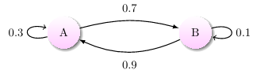
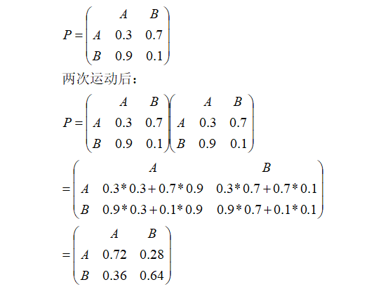
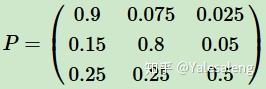

### Markov Chain
马尔可夫链的核心思想为：==**过去所有的信息都已经被保存在当下的状态，基于现在就可以预测未来。**==基于此思想进行的算法的设计，可以大大简化模型复杂度，在时间序列模型中有广泛的应用，如RNN,HMM。
**==随机过程==就是使用统计模型一些事物的过程进行预测和处理**如股价的涨跌，明天是否下雨，等等概率的计算。

### 算法原理
Markov Chain 马尔科夫链为状态空间中经过从一个状态到另一个状态的转换的随机过程，该过程要求具备“**无记忆性** ”，即下一状态的概率分布只能由当前状态决定，在时间序列中它前面的事件均与之无关。这种特定类型的“**无记忆性** ”称作马尔可夫性质。
比如这样一串数列 `1 - 2 - 3 - 4 - 5 - 6`，在马尔科夫链看来，6 的状态只与 5 有关，与前面的其它过程无关。
### 数学定义
假设我们序列状态为$X_{t-2},X_{t-1},... X_{t+1}...$，那么$X_{t+1}$时刻的状态的条件概率仅依赖于$X_{t}$
即：
$P(X_{t+1}|...X_{t-2},X_{t-1},X_{t)} =P(X_{t+1}|X_t)$ 
既然某一时刻状态转移的概率**只依赖于它的前一个状态** ，那么我们只要能求出系统中任意两个状态之间的转换概率，这个马尔科夫链的模型就定了。
#### 转移概率矩阵
通过马尔科夫链的模型转换，我们可以将事件的状态转换成**概率矩阵** （又称**状态分布矩阵** ），如下例：

上图中有 A 和 B 两个状态，A 到 A 的概率是 0.3，A 到 B 的概率是 0.7；B 到 B 的概率是 0.1，B 到 A 的概率是 0.9。

- 初始状态在 A，如果我们求 2 次运动后状态还在 A 的概率是多少？非常简单：
$$P = A → A → A + A → B → A = 0.3 ∗ 0.3 + 0.7 ∗ 0.9 = 0.72 $$
- 如果求 2 次运动后的状态概率分别是多少？初始状态和终止状态未知时怎么办呢？这是就要引入**转移概率矩阵** ，可以非常直观的描述所有的概率。

有了状态矩阵，我们可以很轻松的得出结论。

#### 马尔可夫链模型状态转移矩阵的稳定性

假设我们当前股市的概率分布为： [0.3,0.4,0.3] ，即30%概率的牛市，40%概率的熊盘与30%的横盘。然后这个状态作为序列概率分布的初始状态 $t_0$，将其带入这个状态转移矩阵计算 $t_1,t_2,t_3$ 的状态。代码如下：
```python
```python3
matrix = np.matrix([[0.9, 0.075, 0.025],
                    [0.15, 0.8, 0.05],
                    [0.25, 0.25, 0.5]], dtype=float)
vector1 = np.matrix([[0.3, 0.4, 0.3]], dtype=float)

for i in range(100):
    vector1 = vector1 * matrix
    print('Courrent round: {}'.format(i+1))
    print(vector1)
```
从第60轮开始，我们的状态概率分布就不变了，一直保持[0.625,0.3125,0.0625] ，即62.5%的牛市，31.25%的熊市与6.25%的横盘。