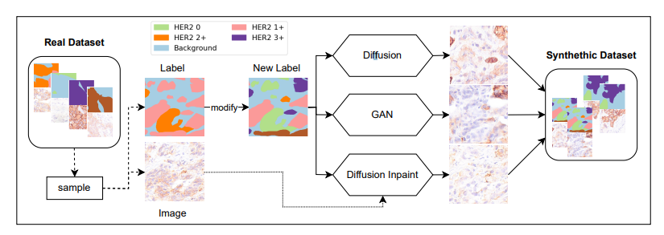
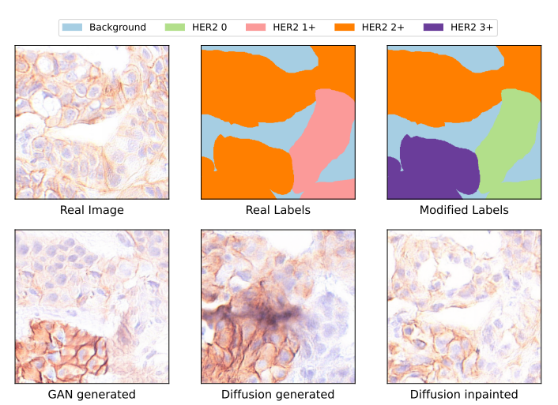
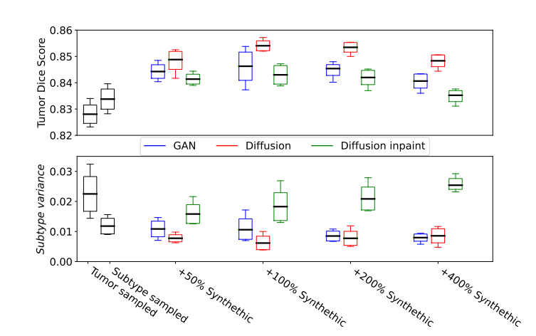

[TOC]

# **《lmproved HER2 Tumor Segmentation with Subtype Balancing using Deep Generative Networks》笔记**

[论文地址](https://arxiv.org/abs/2211.06150)

## 摘要
组织病理学肿瘤图像分割由于各种亚型的不同以及分类的不均衡导致的采样问题常常会导致过拟合现象，本篇文章通过使用diffusion和GAN来生成合成基于亚类型的图像，将合成图像与原始数据集结合，从而提高HER2肿瘤分割的得分。
[肿瘤的亚型](https://www.jianshu.com/p/4e6383c66dcc)
## 介绍
本篇论文专注于根据HER2(人类表皮生长因子受体)染色的乳腺癌样本，根据HER2标记的肿瘤组织的组成，给每个肿瘤样本分配一个综合的HER2分数(治疗的选择基于这个综合分数)。在这项工作中，作者考虑了HER2分割管道的第一步，即针对背景组织的肿瘤组织分割。不同的HER2亚型特征加上这些HER2亚型的不同流行率会导致基础亚型之间的肿瘤分割性能不一致。
由于训练数据量有限，可能训练很快会出现过拟合，为了避免过拟合在其他领域已经由很多通过生成模型(GAN，diffusion)来扩展训练集的应用。基于此，本论文为病理学语义图像合成引入扩散模型，用于解决数据集中亚型不平衡问题。
==贡献==
- 说明了GAN和diffusion对于使用语义子类型条件创建真实的HER2图像的适用性。
- 分析了不同数量的额外合成图像对分割性能的影响，尤其是对整体分割性能和个别亚型的性能。

## 数据集和算法
### 数据集
实验数据来自40名不同患者的40个乳腺组织切片。经过组织化学染色之后使用xxx设备将其转化为WSI图像。在**EXACT**平台上用多边形轮廓线将同一亚型细胞群注释为一个肿瘤组织实例。根据asco/cap guidelines的四种HER2亚型和LCIS&DCIS将组织分为五种亚型，其中LCIS&DCIS被视为四种亚型的复合。
### 生成合成图像

首先，修改标签掩码，从而使生成的合成数据集是亚型平衡的。由于肿瘤组织实例的数量足够多，随机分配的结果是一个亚类型平衡的合成数据集。
==不懂为什么这边标签可以随意修改==
修改后的标签掩码随后被用于以下三种合成图像的生成方法：
[理解latent space](https://zhuanlan.zhihu.com/p/369946876)
[理解VAE](https://zhuanlan.zhihu.com/p/351805989)
#### GAN
使用基于GAN的空间架构的空间适应性归一化，这使只有单一类别存在的条件掩码输出更加真实，确保了高质量图像的合成。同时使用变分自动编码器的潜在空间作为额外输入，从而完成one-to-many任务。
#### Diffusion
使用Rombach、Blattmann等人提出的潜在扩散模型。一个由压缩编码器和解压缩编码器组成的自编码器被用来创建数据的低维潜势表示。图像生成在潜空间进行，减少了由压缩产生的计算成本。和GAN的标签掩码相同。
#### Diffusion Inpaint
使用潜在扩散模型对现有图像的肿瘤涂抹，以修改HER2亚型。不同与前两种的是，扩散模型只修改肿瘤实例，保持背景不变。扩散模型涂抹肿瘤时会考虑图像上下文，允许模型捕捉背景特征。
### 分割肿瘤细胞
使用分割网络对这三种方法生成的图片进行分割对比效果，使用在医学分割领域广泛使用的U-net网络对图像进行分割。U-net的backbone采用预先在ImageNet下训练的ResNet-34，分割任务产生两个输出——背景和肿瘤，使用==交叉熵和dice损失==对模型进行优化。
[dice loss](https://zhuanlan.zhihu.com/p/269592183)
## 实验和结果
对实验结果，定性分析，通过对肿瘤细胞数量和视觉上的观察来评价，定量分析，肿瘤Dice得分评估了独立于亚型的分割结果，Dice值越大效果越好，HER2肿瘤亚型回顾之间的方差评估了分割性能在各个HER2亚型之间的变化程度,越低越有利。做了两种形式的采样，肿瘤采样和基于亚型的采样，通过生成模型的不同和添加数据集的占比不同做了5次对比实验。
### 定性结果——图像生成

### 定量结果——细胞分割

